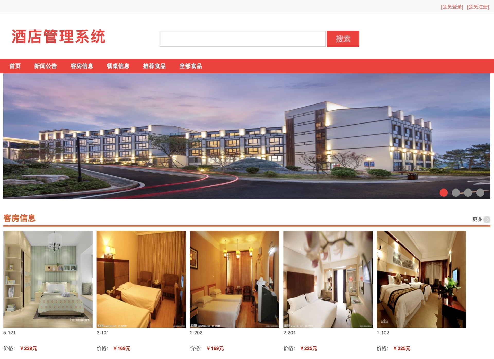
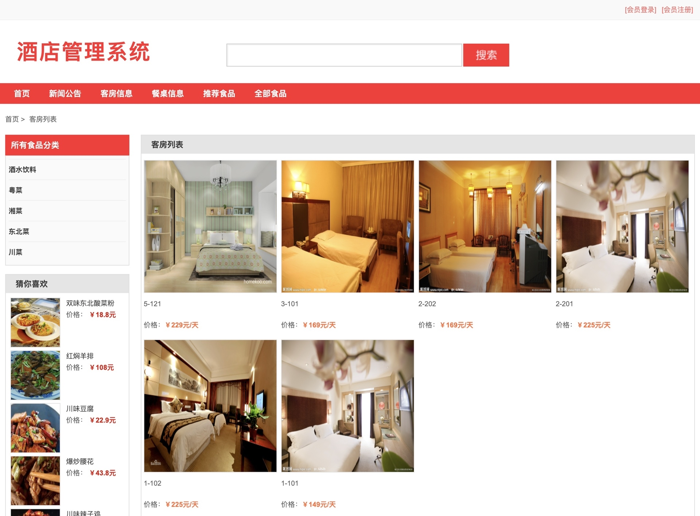
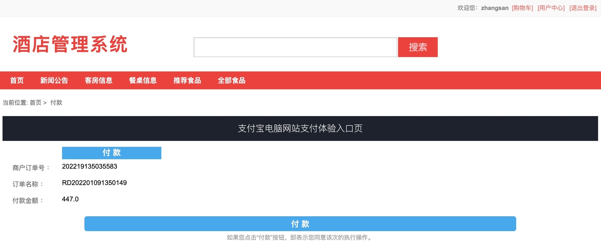
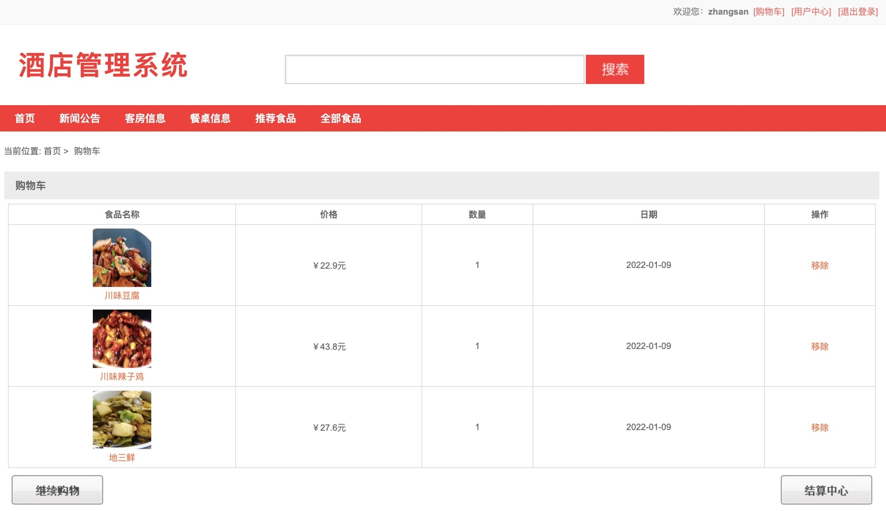
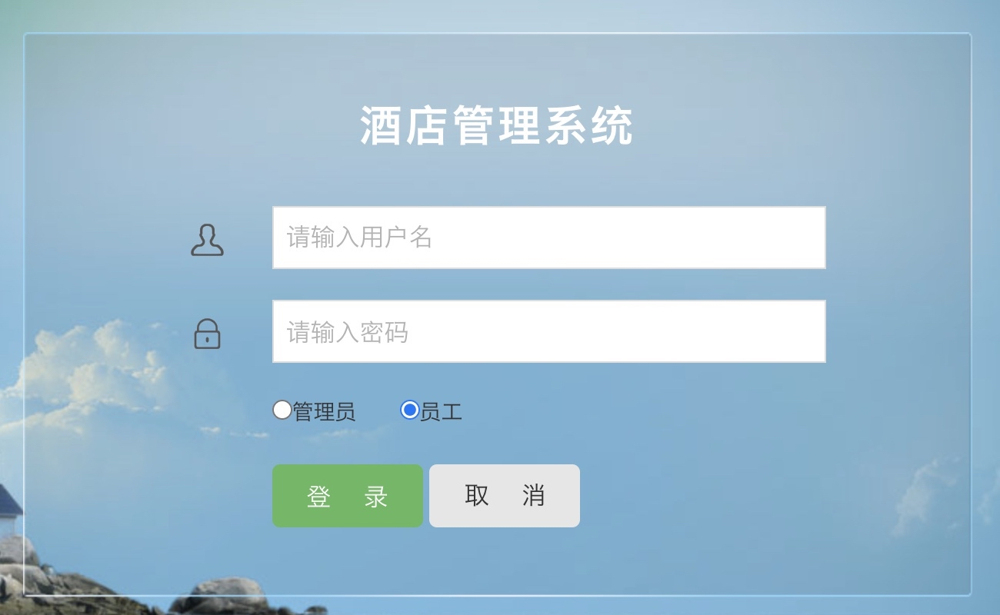
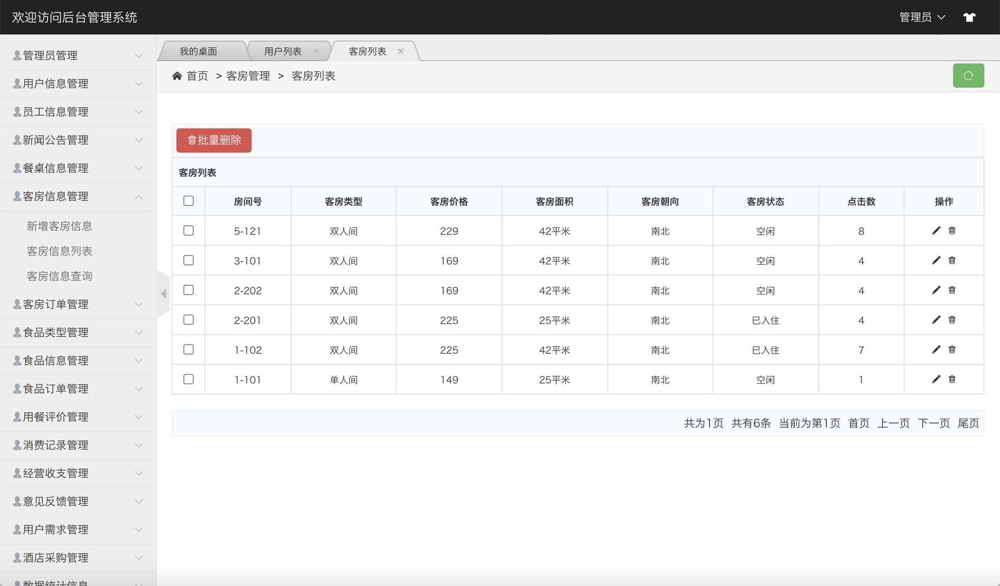

<h1 align="center">基于SSM框架的酒店管理系统</h1>

<h4> 完整代码获取地址：从戎源码网（https://armycodes.com/） </h4>
<h4> 作者微信：19941326836 QQ：605739993 QQ群：655392706 </h4>
<h4> 承接计算机毕设、Java毕业设计、Python毕业设计、深度学习、机器学习 </h4>
<h4> 选题+开题报告+任务书+程序定制+安装调试+论文+答辩ppt 一条龙服务 </h4>
<h4> 毕业设计所有选题地址：(https://github.com/Descartes007/allProject) </h4>

## 一、项目介绍

基于SSM框架的酒店管理系统：前端 jsp、ajax，后端 springboot、spring、mybatis；角色分为管理员、员工和用户；管理员管理后台用户和员工信息，对新闻公告进行发布管理，对客房订单、食品信息、客房类型、消费记录管理等；员工对餐桌信息、食品信息、订单信息进行管理，对留言内容进行回复等；用户根据发布的餐厅和酒店等信息进行选择等。主要功能如下：

### 1、管理员：

- 基本操作：登录、修改密码、获取个人信息、上传图片、留言回复、换肤
- 管理员管理：添加管理员、删除管理员、获取管理员列表、获取管理员详情、修改管理员信息
- 用户管理：获取用户信息列表、查看用户信息详情、删除用户信息、筛选用户信息
- 员工管理：添加员工信息、获取员工信息列表、查看员工信息详情、修改员工信息、删除员工信息、筛选员工信息、员工离职
- 新闻公告管理：发布新闻公告信息、获取新闻公告列表、查看新闻公告详情、修改新闻公告信息、删除新闻公告信息
- 餐桌信息管理：添加餐桌信息、获取餐桌信息列表、查看餐桌信息详情、修改餐桌信息、删除餐桌信息、筛选餐桌信息
- 客房信息管理：添加客房信息、获取客房信息列表、查看客房信息详情、修改客房信息、删除客房信息、筛选客房信息
- 客房订单管理：获取客房订单列表、查看客房订单详情、删除客房订单信息、筛选客房订单信息、退房、入住
- 食品类型管理：添加食品类型信息、获取食品类型信息列表、查看食品类型信息详情、修改食品类型信息、删除食品类型信息、筛选食品类型信息
- 食品信息管理：添加食品信息、获取食品信息列表、查看食品信息详情、修改食品信息、删除食品信息、筛选食品信息
- 食品订单管理：获取食品订单列表、查看食品订单详情、删除食品订单信息、筛选食品订单信息
- 用餐评价管理：获取用餐评价列表、查看用餐评价详情、删除用餐评价信息、筛选用餐评价信息
- 消费记录管理：获取消费记录列表、查看消费记录详情、删除消费记录信息、筛选消费记录信息
- 经营收支管理：获取经营收支列表、查看经营收支详情、删除经营收支信息、筛选经营收支信息
- 意见反馈管理：获取意见反馈列表、查看意见反馈详情、删除意见反馈信息、筛选意见反馈信息、回复反馈
- 用户需求管理：获取用户需求列表、查看用户需求详情、删除用户需求信息、筛选用户需求信息、回复用户需求
- 酒店采购管理：添加采购、获取酒店采购列表、查看酒店采购详情、删除酒店采购信息、筛选酒店采购信息
- 数据统计：收支统计、收入来源统计、用户评价统计

### 2、员工：

- 基本操作：登录、修改密码、获取个人信息、修改个人信息、换肤
- 餐桌信息管理：获取餐桌信息列表、查看餐桌信息详情
- 食品信息管理：获取食品信息列表、查看食品信息详情
- 订单信息管理：获取订单信息列表、查看订单信息详情

### 3、用户：

- 基本操作：登录、修改密码、获取个人信息、修改个人信息、上传图片、注册、意见反馈、回复
- 客房模块：获取客房列表、查看客房信息详情、筛选客房信息、预约入住、付款
- 餐桌模块：获取餐桌列表、查看餐桌信息详情、筛选餐桌信息
- 食品模块：获取食品列表、查看食品信息详情、筛选食品信息、加入购物车、结算、预约订单、推荐食品、评价
- 新闻公告模块：获取新闻公告列表、查看新闻公告信息详情
- 客房订单模块：获取客房订单列表、查看客房订单信息详情、付款
- 餐饮订单模块：获取餐饮订单列表、查看餐饮订单信息详情
- 付款记录模块：获取付款记录列表、查看付款记录信息详情
- 意见反馈模块：获取意见反馈列表、意见反馈
- 客户需求模块：获取客户需求列表、客户需求提交

## 二、环境

- <b>IntelliJ IDEA 2020.3</b>

- <b>Mysql 5.7.26</b>

- <b>Tomcat 9.0.60</b>

- <b>JDK 1.8</b>

## 三、运行截图

